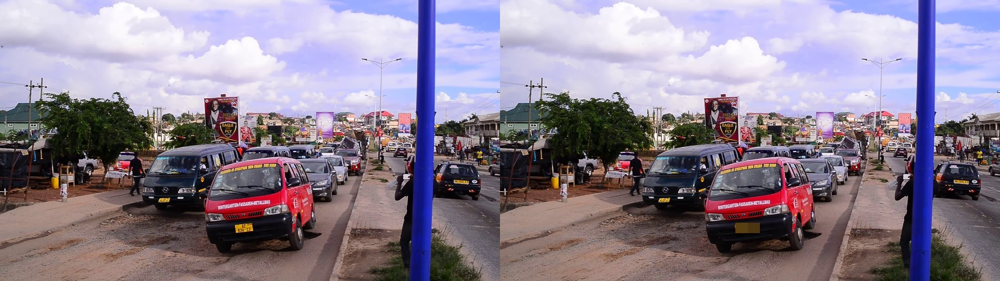

[](https://github.com/himanshu748/marg-ai/actions/workflows/ci.yml)

# MargAI

MargAI is an OpenCV road-damage survey agent. It processes dashcam video,
detects RDD2022 cracks and potholes, tracks observations into instances,
preserves full-resolution evidence, and uses an approval-gated agent to draft
municipal work orders.

## Architecture

```text
dashcam + GPX
     |
     v
OpenCV 5 DNN -> quality/keyframes -> tracker/evidence -> result.json
                                      |
                                      v
                              agent tools + MockLLM/Bedrock
                                      |
                         work orders + human approval dashboard

AWS upload -> S3 uploads -> SQS -> Fargate worker -> S3 survey outputs
                                      |                 |
                                      +-> DynamoDB -----+-> ALB/FastAPI dashboard
```

The tracker applies configurable `min_observations` gating to discard only
short, low-confidence tracks.

## Local quickstart

```bash
python -m venv /home/ubuntu/venv
/home/ubuntu/venv/bin/pip install -e '.[api,dev]'
/home/ubuntu/venv/bin/python -m marg.vision.pipeline \
  --video /path/to/road-video.webm --out outputs/demo
/home/ubuntu/venv/bin/python -m marg.agent.loop \
  --result outputs/demo/result.json --llm mock --out outputs/demo/agent
/home/ubuntu/venv/bin/python -m marg.api --data outputs --port 8000
```

Open `http://localhost:8000`.

For a zero-setup judge quickstart using the committed demo surveys:

```bash
MARG_DATA_ROOT=demo python -m marg.entrypoint
```

### Privacy redaction

When `VisionConfig.redact` is enabled (the default), OpenCV 5 DNN privacy
detectors redact faces with YuNet (`face_detection_yunet_2023mar.onnx`, MIT)
and plates with LPD-YuNet (`license_plate_detection_lpd_yunet_2023mar.onnx`,
Apache-2.0). Plate search uses the full frame plus six overlapping upper and
lower tiles; this avoids losing small plates in a 320x240 full-frame resize.
Pixelation never modifies the protected road-damage bbox. `evidence_raw/` is
retained only for agent re-inspection and is not served by the API.



## AWS deployment

The AWS stack in `infra/deploy.sh` is the live deployment target.
The deployment uses one public-IP Fargate task, an ALB, S3, SQS, DynamoDB,
ECR, and CloudWatch Logs. The default task is ARM64 Graviton-compatible,
1 vCPU and 2 GB memory.

```bash
aws configure
AWS_REGION=us-east-1 infra/deploy.sh
MARG_S3_BUCKET="$(aws cloudformation describe-stacks --stack-name margai \
  --query 'Stacks[0].Outputs[?OutputKey==`Bucket`].OutputValue' --output text)" \
  infra/seed_demo.sh
```

`infra/deploy.sh` discovers the default VPC and default subnets, builds and
pushes the image, deploys `infra/cloudformation.yaml`, and prints the ALB URL.
If ARM64 binfmt or the build fails, it retries with an X86_64 image and task
definition. The worker uses the MockLLM by default; set
`MARG_AGENT_LLM=bedrock` (and `MARG_BEDROCK_MODEL_ID`) to use Bedrock.

## Environment variables

| Variable | Purpose | Default |
| --- | --- | --- |
| `AWS_REGION` | AWS region | `us-east-1` |
| `MARG_S3_BUCKET` | Enables S3-backed API storage | unset |
| `MARG_S3_PREFIX` | S3 key prefix | empty |
| `MARG_S3_CACHE_DIR` | Local survey cache | `/tmp/marg-cache` |
| `MARG_SQS_QUEUE_URL` | Upload worker queue | unset |
| `MARG_AGENT_LLM` | Worker agent backend | `mock` |
| `MARG_BEDROCK_MODEL_ID` | Bedrock model ID | `us.amazon.nova-pro-v1:0` |
| `MARG_WORK_ORDERS_TABLE` | Work-order table | `margai-work-orders` |
| `MARG_SURVEYS_TABLE` | Survey status table | `margai-surveys` |

## Evaluation and tests

```bash
/home/ubuntu/venv/bin/ruff check .
/home/ubuntu/venv/bin/python -m pytest -q
/home/ubuntu/venv/bin/python eval/eval_agent.py --llm mock
/home/ubuntu/venv/bin/python eval/eval_detector.py \
  --images /home/ubuntu/assets/rdd2022_india/eval_slice/images \
  --labels /home/ubuntu/assets/rdd2022_india/eval_slice/labels \
  --out eval/results/detector_india.json
/home/ubuntu/venv/bin/python eval/eval_dedupe.py
```

### Detector evaluation

The OpenCV DNN detector was evaluated on a 600-image labelled India slice from
RDD2022. AP uses all-point interpolation over confidence-ranked detections at
IoU 0.50; production precision and recall use confidence threshold 0.25.

| Class | AP@0.5 | TP | FP | FN |
| --- | ---: | ---: | ---: | ---: |
| D00 | 0.6819 | 156 | 44 | 91 |
| D10 | 0.7033 | 4 | 2 | 7 |
| D20 | 0.8593 | 307 | 37 | 61 |
| D40 | 0.7116 | 425 | 90 | 228 |
| **mAP@0.5** | **0.7390** | | | |

At the production threshold, precision was **0.8376** and recall was
**0.6974**. Median inference latency was **177.64 ms**, p95 latency
**225.09 ms**, and throughput **5.37 images/s** on an
**INTEL(R) XEON(R) PLATINUM 8559C** CPU. Annotated failures are in
`docs/failures/`.

### Deduplication evaluation

Manual visible-pothole counts were made from the evidence frames and keyframes.
`min_observations=2` drops a closed track only when it also has
`best_fused_conf < 0.55`. Recall stayed at 1.000 on both videos.

| Survey | Stage | Detections | Instances | Compression | Visible potholes | Unique precision | Unique recall |
| --- | --- | ---: | ---: | ---: | ---: | ---: | ---: |
| pothole_cars | Before gating | 21 | 4 | 5.25:1 | 1 | 0.250 | 1.000 |
| pothole_cars | After gating | 21 | 3 | 7.00:1 | 1 | 0.333 | 1.000 |
| pothole_kumasi | Before gating | 96 | 3 | 32.00:1 | 2 | 0.667 | 1.000 |
| pothole_kumasi | After gating | 96 | 3 | 32.00:1 | 2 | 0.667 | 1.000 |

The latest privacy-enabled demo runs recorded 21 redactions for
`pothole_cars` and 19 for `pothole_kumasi`. Evidence redaction averaged
332.57 ms and 345.81 ms per evidence frame respectively.

Per-instance observation counts are `[2, 1, 4, 14]` for `pothole_cars` and
`[62, 32, 2]` for `pothole_kumasi`. Full output is in
`eval/results/dedupe.md`.

### Run the test suite / CI

```bash
/home/ubuntu/venv/bin/ruff check .
/home/ubuntu/venv/bin/python -m pytest -q
```

The same Ruff and pytest checks run on pushes and pull requests in GitHub
Actions. The current local suite passes **22 tests**.

## Licenses and attribution

- OpenCV is Apache-2.0.
- The exported RDD2022 YOLO model has an AGPL-3.0 source/export note; review
  the upstream terms before redistribution.
- RDD2022 is used under CC BY-SA 4.0.
- The pothole video fixtures are CC BY-SA 4.0 by Amuzujoe.
- The Bengaluru pothole image is Wikimedia Commons material; attribution is
  recorded in `tests/fixtures/LICENSES.md`.
