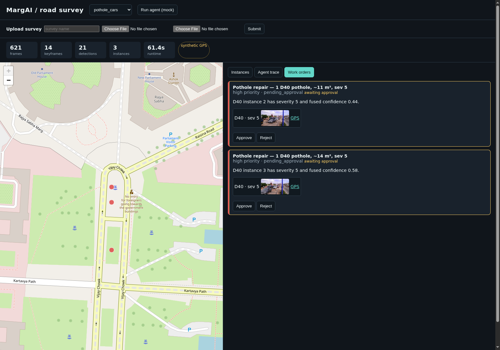

[](https://github.com/himanshu748/marg-ai/actions/workflows/ci.yml)

# MargAI

MargAI is an OpenCV road-damage survey agent. It processes dashcam video,
detects RDD2022 cracks and potholes, tracks observations into instances,
retains evidence frames, and uses an approval-gated agent to draft
municipal work orders.

The local workbench supports video upload, evidence review, policy traces, and
human decisions while Bedrock access is pending. Its default review mode is
deterministic; it does not claim live model reasoning.

## Architecture

```text
dashcam + GPX
     |
     v
OpenCV 5 DNN -> quality/keyframes -> tracker/evidence -> result.json
                                      |
                                      v
                              agent tools + MockLLM/Bedrock
                                      |
                         work orders + human approval dashboard

AWS upload -> S3 uploads -> SQS -> Fargate worker -> S3 survey outputs
                                      |                 |
                                      +-> DynamoDB -----+-> ALB/FastAPI dashboard
```

The tracker applies configurable `min_observations` gating to discard only
short, low-confidence tracks.

## Local quickstart

Use Python 3.10 or newer (the container image uses 3.10) from the repository root. The ONNX files under `models/` are
required for new surveys and agent inspections. See [model attribution](models/LICENSES.md).

```bash
python3 -m venv .venv
.venv/bin/python -m pip install -e '.[api,dev]'
.venv/bin/python -c "import shutil; shutil.copytree('demo', 'outputs/workbench')"
env -u MARG_S3_BUCKET -u MARG_SQS_QUEUE_URL \
  MARG_DATA_ROOT=outputs/workbench MARG_READ_ONLY=0 \
  MARG_AGENT_LLM=mock MARG_BEDROCK_ENABLED=0 \
  .venv/bin/python -m uvicorn marg.api.app:app --host 127.0.0.1 --port 8000
```

Open [localhost:8000](http://localhost:8000). The copy step refuses an existing
`outputs/workbench` directory; reuse an existing copy by skipping that step or
choose a new output directory. Keep the tracked `demo/` fixtures unchanged.

Upload a video with optional timestamped GPX. Without GPX, the interface labels
the location as synthetic. Processing and deterministic review run locally with
observable job status. Set `MARG_READ_ONLY=1` for a view-only workspace.

See [local operations and the API contract](LOCAL_OPERATIONS.md) for authentication,
limits, persistence, failure handling, and future AWS deployment requirements.

### Privacy redaction

When `VisionConfig.redact` is enabled (the default), OpenCV 5 DNN privacy
detectors redact faces with YuNet (`face_detection_yunet_2023mar.onnx`, MIT)
and plates with LPD-YuNet (`license_plate_detection_lpd_yunet_2023mar.onnx`,
Apache-2.0). Plate search uses the full frame plus six overlapping upper and
lower tiles; this avoids losing small plates in a 320x240 full-frame resize.
Sensitive faces and plates remain redacted even where they overlap a road-damage
box. Missing or failing privacy detectors stop processing instead of silently
exporting unchecked images. Automated detection can still miss sensitive pixels;
review exports before sharing. `evidence_raw/` is private agent re-inspection
material and is not served by the API.

The committed sample imagery predates these privacy changes. Regenerate surveys
before publishing new evidence; old images are not retroactively corrected.

## AWS deployment

The current deployment template defaults to read-only access and deterministic
review. A writable deployment normally requires HTTPS, a matching dashboard
domain, and an API token loaded from AWS Secrets Manager. For the judging
window only, token-authenticated HTTP writes can be enabled explicitly with
`MARG_ALLOW_INSECURE_WRITES=true`; the token travels in plaintext.
ARM64 is the default; selecting X86_64 is explicit, and a failed build does
not switch architectures.

The deployment uses one public-IP Fargate task, an ALB, S3, SQS, DynamoDB,
ECR, and CloudWatch Logs. The default task is ARM64 Graviton-compatible,
1 vCPU and 2 GB memory.

The stack uses one Fargate task, an ALB, S3, SQS, DynamoDB, ECR, and CloudWatch.
Deployment creates billable resources. Follow [LOCAL_OPERATIONS.md](LOCAL_OPERATIONS.md)
and validate the template before running `infra/deploy.sh`. These changes have
not been deployed to AWS or verified with a live Bedrock call.

For a writable HTTP judging deployment, create a token secret and pass its ARN:

```bash
aws secretsmanager create-secret --name margai/api-token --secret-string "$(openssl rand -hex 24)"
MARG_DEPLOY_READ_ONLY=false MARG_ALLOW_INSECURE_WRITES=true \
MARG_API_TOKEN_SECRET_ARN=<arn> AWS_REGION=us-east-1 infra/deploy.sh
```

The token travels in plaintext over HTTP; use this only for the judging window.

### Deployment evidence — 2026-09-07

PR #5, commit `f5fb1d4`, recorded an ARM64 Fargate deployment in `us-east-1`
and reported that the stack was later torn down. The stack was torn down
afterwards to save budget and will be redeployed for the judging window.



```text
Recorded health response: {"status":"ok","read_only":false}
Recorded task: RUNNING, 1024 CPU / 2048 MiB, Linux ARM64, Fargate 1.4.0
```

## Evaluation and tests

```bash
.venv/bin/ruff check .
.venv/bin/python -m pytest -q
.venv/bin/python eval/eval_agent.py --llm mock
.venv/bin/python eval/eval_detector.py \
  --images /path/to/rdd2022_india/eval_slice/images \
  --labels /path/to/rdd2022_india/eval_slice/labels \
  --out eval/results/detector_india.json
.venv/bin/python eval/eval_dedupe.py
```

The historical x86 vs Graviton4 benchmark uses stock OpenCV wheels and is
documented in [docs/BENCHMARK.md](docs/BENCHMARK.md). It does not measure COOL.

### Historical detector evaluation

The following measurements are preserved from the 2026-09-07 PR #5 baseline
(the evaluation artifact was committed on 2026-09-06). They were not rerun for
this workbench update and are not current hardware or model-access claims.


The OpenCV DNN detector was evaluated on a 600-image labelled India slice from
RDD2022. AP uses all-point interpolation over confidence-ranked detections at
IoU 0.50; production precision and recall use confidence threshold 0.25.

| Class | AP@0.5 | TP | FP | FN |
| --- | ---: | ---: | ---: | ---: |
| D00 | 0.6819 | 156 | 44 | 91 |
| D10 | 0.7033 | 4 | 2 | 7 |
| D20 | 0.8593 | 307 | 37 | 61 |
| D40 | 0.7116 | 425 | 90 | 228 |
| **mAP@0.5** | **0.7390** | | | |

At the production threshold, precision was **0.8376** and recall was
**0.6974**. Median inference latency was **177.64 ms**, p95 latency
**225.09 ms**, and throughput **5.37 images/s** on an
**INTEL(R) XEON(R) PLATINUM 8559C** CPU. Annotated failures are in
`docs/failures/`.

### Historical deduplication evaluation

These figures are also retained from the PR #5 baseline.


Manual visible-pothole counts were made from the evidence frames and keyframes.
`min_observations=2` drops a closed track only when it also has
`best_fused_conf < 0.55`. Recall stayed at 1.000 on both videos.

| Survey | Stage | Detections | Instances | Compression | Visible potholes | Unique precision | Unique recall |
| --- | --- | ---: | ---: | ---: | ---: | ---: | ---: |
| pothole_cars | Before gating | 21 | 4 | 5.25:1 | 1 | 0.250 | 1.000 |
| pothole_cars | After gating | 21 | 3 | 7.00:1 | 1 | 0.333 | 1.000 |
| pothole_kumasi | Before gating | 96 | 3 | 32.00:1 | 2 | 0.667 | 1.000 |
| pothole_kumasi | After gating | 96 | 3 | 32.00:1 | 2 | 0.667 | 1.000 |

The historical privacy-enabled demo runs recorded 21 redactions for
`pothole_cars` and 19 for `pothole_kumasi`. Evidence redaction averaged
332.57 ms and 345.81 ms per evidence frame respectively.

Per-instance observation counts are `[2, 1, 4, 14]` for `pothole_cars` and
`[62, 32, 2]` for `pothole_kumasi`. Full output is in
`eval/results/dedupe.md`.

### Run the test suite / CI

```bash
.venv/bin/ruff check .
.venv/bin/python -m pytest -q
```

The same Ruff and pytest checks run on pushes and pull requests in GitHub
Actions. Test counts change as coverage grows; use the command output from the
checkout being reviewed. Local tests do not establish live AWS, Bedrock, or COOL
Marketplace availability.

## Licenses and attribution

- OpenCV is Apache-2.0.
- The exported RDD2022 YOLO model has an AGPL-3.0 source/export note; review
  the upstream terms before redistribution.
- RDD2022 is used under CC BY-SA 4.0.
- The pothole video fixtures are CC BY-SA 4.0 by Amuzujoe.
- The Bengaluru pothole image is Wikimedia Commons material; attribution is
  recorded in `tests/fixtures/LICENSES.md`.
