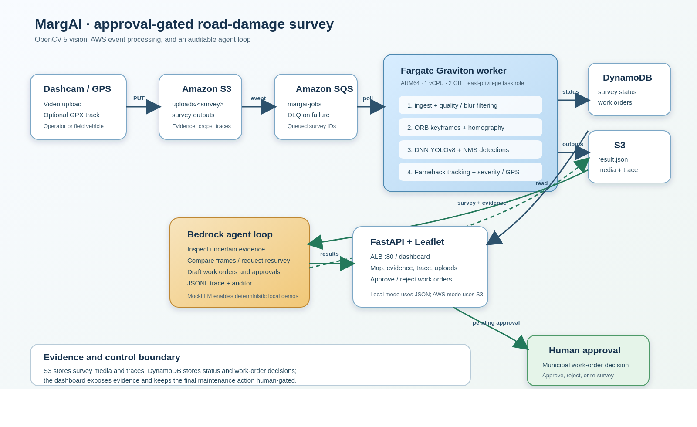

# MargAI architecture

The hand-authored SVG version is available at
[`architecture.svg`](architecture.svg). MargAI has two compatible execution
modes:

1. **Local reproducible mode.** The OpenCV 5 pipeline writes a survey directory
   containing `result.json`, keyframes, evidence, crops, and GPS metadata.
   The MockLLM agent can then inspect the survey and produce a trace and
   work-order drafts without cloud credentials.
2. **AWS delivery mode.** An upload is stored under an S3 survey prefix and a
   survey ID is placed on SQS. A single ARM64 Fargate Graviton worker runs the
   same pipeline and agent, writes survey media to S3, and records status and
   work-order records in DynamoDB. FastAPI behind an ALB serves the Leaflet
   dashboard and human approval actions.

The worker stages are quality and blur filtering, ORB keyframe selection with
RANSAC homography checks, OpenCV DNN ONNX inference, optical-flow tracking,
severity and GPS enrichment, write-time YuNet face/plate redaction, and
evidence generation. The agent is deliberately approval-gated: it may draft a
work order, but the dashboard's human decision is the final action.

The AWS stack is defined in `infra/cloudformation.yaml` and built by
`infra/deploy.sh`. PR #5 recorded a September 7, 2026 deployment that was later
removed for budget control; see the historical record in the README. The
diagram describes the target architecture, not a currently running service.
The current repair uses local and mocked-cloud verification only.
