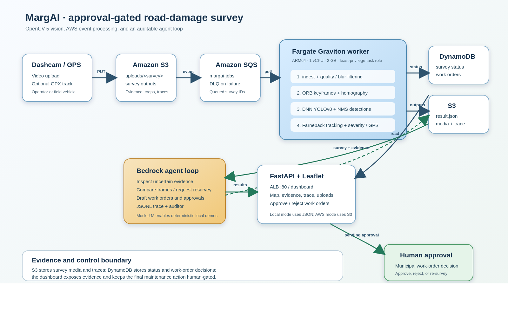
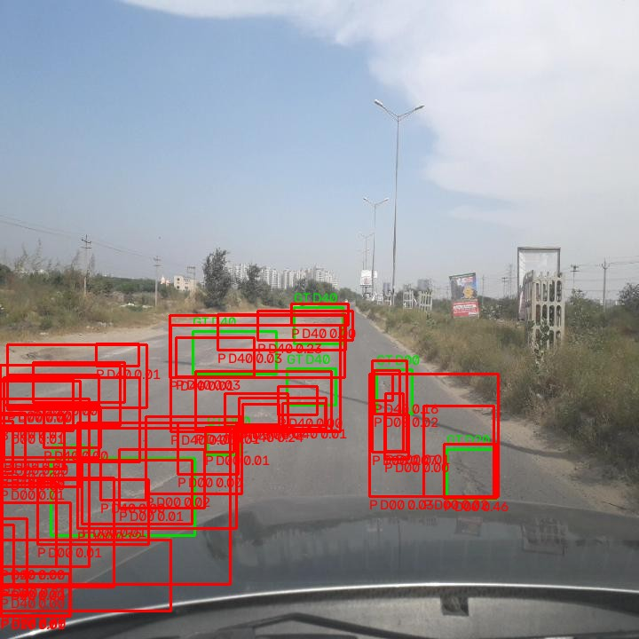
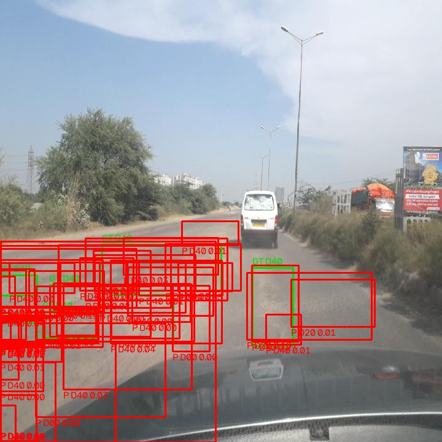
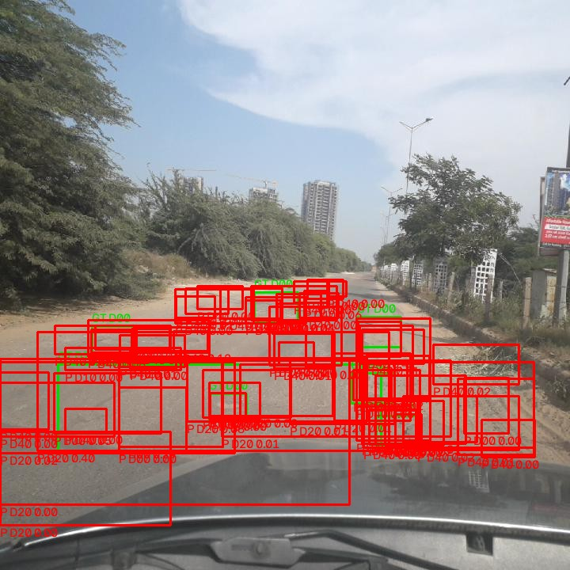
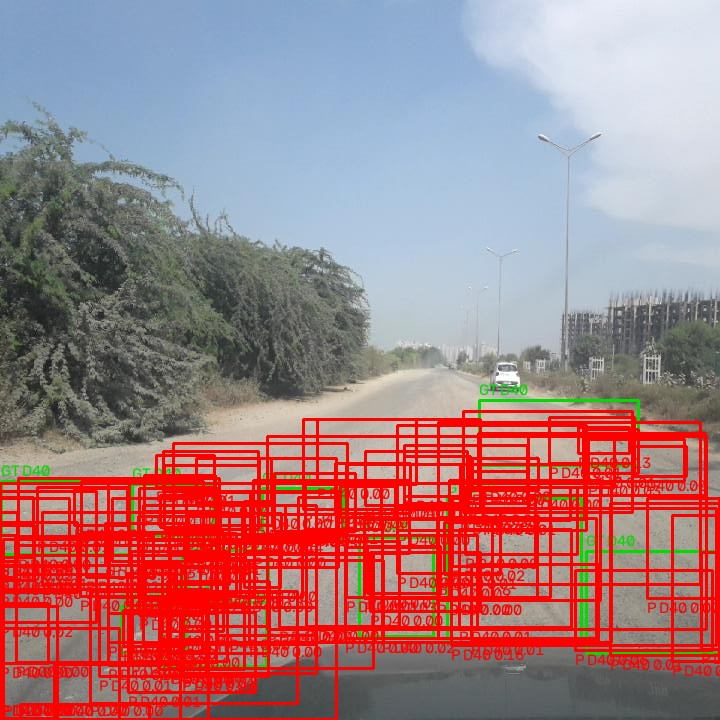
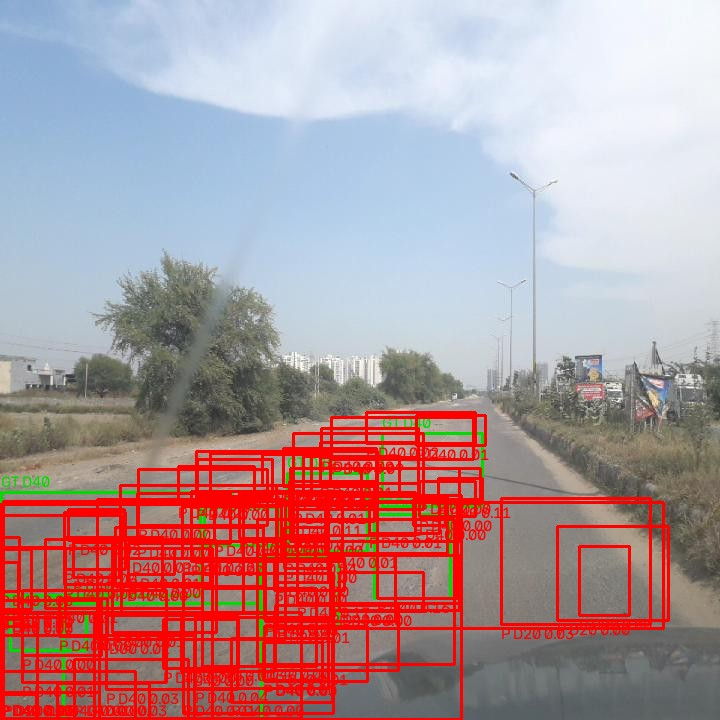
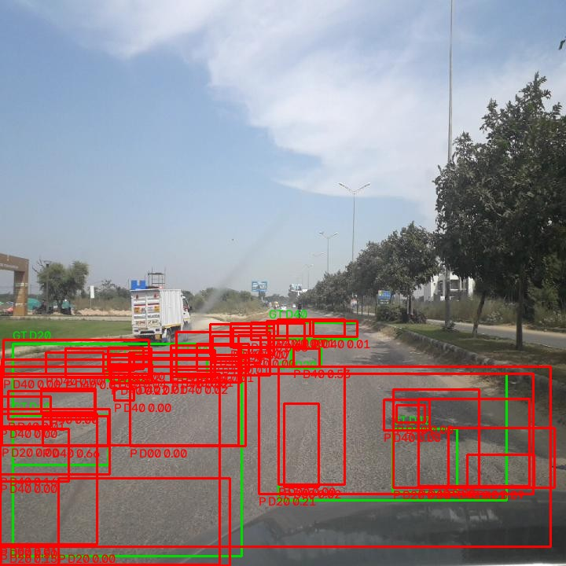
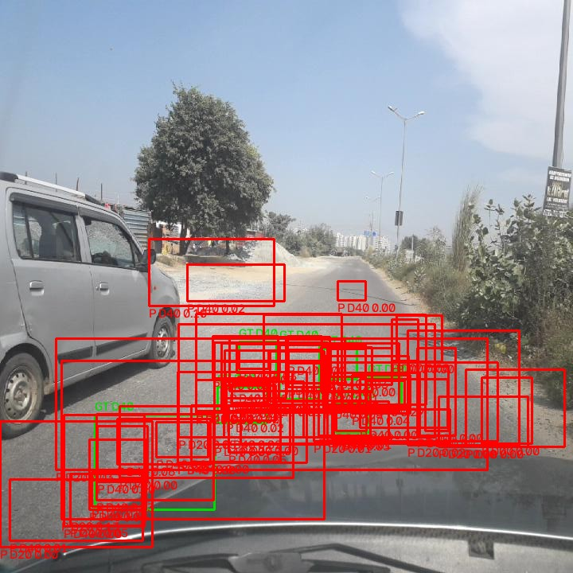
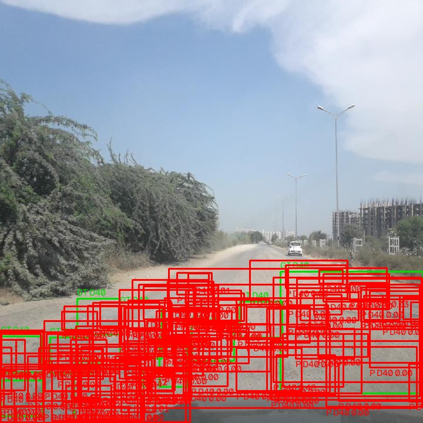

# MargAI: an approval-gated OpenCV road-damage survey agent

**OpenCV AI Competition 2026 technical report**
**Judges:** Gary Bradski and Phil Nelson

## Abstract

Road damage is often reported after it has become expensive to repair. A
municipality needs more than a detector screenshot: it needs a repeatable
survey, a location, evidence that can be reviewed, and a safe way to turn an
observation into a maintenance action. MargAI treats dashcam video as a
structured survey. OpenCV 5 extracts quality-controlled frames, detects the
four RDD2022 road-damage classes, tracks observations into unique instances,
estimates severity and location, and preserves full-resolution evidence. An
approval-gated agent then examines uncertain cases, compares observations,
requests a re-survey when needed, and drafts a work order without bypassing a
human decision.

This report is intentionally quantitative. The local detector evaluation on a
600-image RDD2022 India slice reached 0.7390 mAP@0.5 and 0.8376 precision at
the production threshold. The two licensed pothole videos compressed 21
detections to four tracked instances and 96 detections to three instances.
The AWS implementation is complete in code but is not yet live in the
account used for this submission; all local pipeline, agent, API, and
evaluation claims below were exercised locally.

## Problem and impact

India's roads contain a mix of longitudinal cracks, transverse cracks,
alligator cracking, and potholes. Damage is spatially uneven, changes with
rain and traffic, and is frequently documented with an isolated photograph
that lacks a reliable position or a view of the surrounding road. This
creates three operational problems: inspection teams spend time searching
for defects that a vehicle already passed, repeated reports inflate the
apparent backlog, and a maintenance request can be difficult to verify after
the fact.

MargAI is designed as a survey assistant rather than an autonomous repair
authority. A vehicle records a route; the system produces a compact inventory
of damage instances with evidence, approximate coordinates, class, severity,
and observation history. An agent can organize that inventory into drafts,
but a human must approve a work order. This separation is important when
false positives can redirect limited road-maintenance budgets or when a
defect is temporarily obscured by a vehicle, water, glare, or shadow.

The current prototype targets the four CRDDC/RDD2022 labels: `D00`
(longitudinal crack), `D10` (transverse crack), `D20` (alligator crack), and
`D40` (pothole). It can use a GPX track when available and records that the
GPS source is synthetic when the input has no track.

## System overview

The complete hand-authored diagram is available as
[`architecture.svg`](architecture.svg). Local execution starts with
`marg.vision.pipeline`, which reads a video and optional GPX file and writes a
survey directory. The agent CLI consumes `result.json` and writes an agent
result and JSONL trace. FastAPI serves the same directory to the dashboard.

The AWS path keeps the processing contract unchanged. An upload enters S3
under a survey prefix and places a survey ID on SQS. A Fargate worker
downloads the inputs, runs the pipeline and agent, uploads the outputs, and
updates DynamoDB. The dashboard reads status and evidence through the API.
The final edge in the system is explicit human approval, not an automatic
dispatch to a contractor.

### Survey data contract

The durable unit is a `SurveyResult`. It records the source video summary,
processed-frame count, keyframe count, class detection counts, runtime,
geolocation source, tracked `SurveyInstance` objects, and route segments.
Each instance has a representative box, class, confidence, fused confidence,
severity, estimated area, latitude and longitude, keyframe IDs, and a list of
per-frame `Observation` records. An observation retains its frame index,
timestamp, box, class, raw confidence, and fused confidence. This structure
means the dashboard can explain why an instance exists instead of presenting
only a final aggregate.

Media paths are survey-relative. The best observation is saved under
`evidence/`, keyframes are saved under `keyframes/`, and instance crops under
`crops/`. The agent writes its result and trace under `agent/`. Relative paths
are important in both execution modes: the local API resolves them under a
survey directory, while the S3 store maps the same names to an object prefix.
The contract also makes migration possible: an old local result can be copied
to S3 without rewriting its internal references.

The API deliberately exposes status separately from result data. A queued
survey can be shown immediately after upload, a processing survey can report
progress, and a failed survey retains an error status rather than disappearing
from the operator's list. This is useful for a field workflow where a worker
may be offline or a route may need to be retried.

## OpenCV 5 implementation

MargAI uses the OpenCV 5 Python wheel (`cv2.__version__` reports 5.0.0) for
video I/O, image processing, geometry, tracking, and neural-network
inference. The package is pinned to `opencv-python==5.0.0.93`; no alternate
Torch inference path is used in production.

### Video I/O and frame quality

`marg/vision/ingest.py` uses `cv2.VideoCapture` with
`cv2.CAP_PROP_FPS` and `cv2.CAP_PROP_POS_MSEC` to preserve frame timing.
Frames can be resized with `cv2.resize` and `INTER_AREA` before downstream
processing. `marg/vision/quality.py` converts frames with `cv2.cvtColor`
and measures sharpness using the variance of
`cv2.Laplacian(gray, cv2.CV_64F)`. The quality gate rejects frames that are
too dark, too bright, or too blurred for dependable evidence.

This is a deliberately inexpensive gate. It avoids running a detector on
frames that are unlikely to produce useful evidence while retaining the
original frame timing for tracking and GPS interpolation.

### ORB keyframes and RANSAC motion checks

`marg/vision/keyframes.py` creates ORB features with `cv2.ORB_create`.
Descriptors are matched with `cv2.BFMatcher(cv2.NORM_HAMMING)`. Candidate
keyframes are accepted using feature-change and spacing rules, while
`cv2.findHomography(..., cv2.RANSAC, 5.0)` estimates whether enough matched
features agree on a camera motion model. This gives the survey a compact set
of representative views instead of saving every frame.

Keyframes are not the only evidence source. The tracker records observations
from every processed frame, and the pipeline writes an evidence frame when an
instance's best fused observation improves. This distinction matters for
detections that occur between two keyframes.

### OpenCV DNN ONNX detector

`marg/vision/detector.py` loads the exported YOLOv8-small RDD model using
`cv2.dnn.readNetFromONNX`. Inputs are created with
`cv2.dnn.blobFromImage`, letterboxed with `cv2.resize`, and forwarded through
the OpenCV DNN backend. The output is decoded into class-labelled boxes and
filtered with `cv2.dnn.NMSBoxes`.

The evaluation path sets confidence to 0.001 so the full confidence-ranked
prediction list is available for precision-recall curves. The production
pipeline uses 0.25. A regression test covers the output width of the
RDD2022 export: each row contains four box values plus four class scores.
The model is therefore exercised through the same `cv.dnn` path used by the
survey worker.

### Optical-flow tracking

`marg/vision/pipeline.py` computes reduced grayscale images and uses
`cv2.calcOpticalFlowFarneback` between processed frames. The resulting flow
warps active bounding boxes and allows detections to be associated across
time. `marg/vision/tracker.py` combines IoU, class, confidence, and age
constraints to maintain tracks. Every observation stores frame index,
timestamp, box, class, raw confidence, and fused confidence. The best
observation determines the representative instance box and evidence frame.

This is the source of the deduplication measurement: a detection is a
frame-level signal, while an instance is the tracked road defect that should
appear once in an operational report.

### Perspective severity and classical cues

`marg/vision/severity.py` estimates physical area from the image box using
`cv2.getPerspectiveTransform`, `cv2.perspectiveTransform`, and
`cv2.contourArea`. The result is quantized to a severity score from one to
five. It is an estimate, not a calibrated civil-engineering measurement.

`marg/vision/classical.py` supplies supporting cues for potholes. It converts
images with `cv2.cvtColor(..., cv2.COLOR_BGR2LAB)`, compares dark-pixel
ratios against a road-band median, and measures texture using
`cv2.Laplacian(...).var()`. These cues are fused with the neural detector
confidence. They are useful for ranking and evidence quality, but do not
replace the learned detector.

## Agentic loop

The agent receives a `SurveyResult`, not raw unbounded video. Its policy is
implemented in `marg/agent/prompts.py`, executed by
`marg/agent/loop.py`, and checked by `marg/agent/auditor.py`.

The five mandatory policy rules are:

1. Inspect every low-confidence instance before including it in a work order.
2. Compare frames when confidence or class evidence is inconsistent.
3. High-severity potholes require a high-priority work-order draft and human
   approval.
4. Medium-priority work orders also require human approval.
5. Finalize exactly once and stay within the 25-tool-call budget.

The tools are `inspect_roi`, `compare_frames`, `request_resurvey`,
`draft_work_order`, `request_human_approval`, `dismiss_instance`, and
`finalize`. ROI inspection uses the best full-resolution evidence frame,
expands context around the box, reruns the detector, maps detections back to
frame coordinates, and saves an annotated crop. Work-order records include
the segment, per-instance severity and GPS, evidence filename, generated
title, priority, and the agent's reason.

`MockLLM` implements the same policy deterministically for local testing.
`BedrockLLM` uses the Converse API with the system prompt in the `system`
field, explicit inference limits, and multi-tool result handling. Every
model message, tool input, output, and latency is written to a JSONL trace.
The auditor reports rule-level pass/fail results and offending IDs.

The synthetic evaluation includes five policy cases and a 30-instance budget
case. The measured table is reproduced from `eval/results/agent_mock.json`:

| Scenario | Result | Tool calls |
| --- | ---: | ---: |
| S1 | PASS | 4 |
| S2 | PASS | 3 |
| S3 | PASS | 2 |
| S4 | PASS | 4 |
| S5 | PASS | 1 |
| S6 | PASS | 25 |

## Cloud delivery and reproducibility

`infra/cloudformation.yaml` defines the target AWS stack: a blocked-public S3
bucket with a 30-day lifecycle, SQS and a dead-letter queue, on-demand
DynamoDB tables for surveys and work orders, ECR, an ECS cluster, a
seven-day CloudWatch log group, IAM execution and task roles, an ARM64
Fargate task, an ALB, target group, listener, and security groups. The task
is configured for one vCPU and 2 GB memory. The task role is scoped to the
application's S3 bucket, queue, tables, logs, and Bedrock invocation rather
than using administrator permissions.

The intended default is Graviton ARM64. `infra/deploy.sh` discovers the
default VPC and subnets, builds with Docker Buildx, pushes to ECR, deploys the
CloudFormation stack, and prints the dashboard URL. It contains an x86_64
fallback when ARM64 binfmt or image construction is unavailable.

At the prototype scale, the requested cost estimate is approximately
**$45/month**: Fargate 1 vCPU/2 GB ARM64 at approximately **$0.033/hour**,
an ALB at approximately **$0.0225/hour plus LCU**, and modest S3, SQS,
DynamoDB, ECR, and CloudWatch usage. This is an estimate, not a bill.
Deployment is **not yet live**: account-level service activation blocked the
previous deployment attempt. The CloudFormation and scripts remain in the
repository for reproducibility; live endpoint verification is pending AWS
activation.

## Evaluation

### Detector evaluation

The detector evaluation used a 600-image India slice. It supports Pascal VOC
XML and the downloaded YOLO label representation. AP is all-point
interpolated AP over confidence-ranked detections.

| Class | AP@0.5 | TP | FP | FN |
| --- | ---: | ---: | ---: | ---: |
| D00 | 0.6819 | 156 | 44 | 91 |
| D10 | 0.7033 | 4 | 2 | 7 |
| D20 | 0.8593 | 307 | 37 | 61 |
| D40 | 0.7116 | 425 | 90 | 228 |
| **mAP** | **0.7390** | | | |

| Production metric | Value |
| --- | ---: |
| Precision @ 0.25 | 0.8376 |
| Recall @ 0.25 | 0.6974 |
| Median inference latency (ms) | 177.64 |
| P95 inference latency (ms) | 225.09 |
| Inference throughput (images/s) | 5.37 |

### Deduplication evaluation

| Survey | Detections | Instances | Compression | Visible potholes | Unique precision | Unique recall |
| --- | ---: | ---: | ---: | ---: | ---: | ---: |
| pothole_cars | 21 | 4 | 5.25:1 | 1 | 0.250 | 1.000 |
| pothole_kumasi | 96 | 3 | 32.00:1 | 2 | 0.667 | 1.000 |

| Survey | Per-instance observation counts |
| --- | --- |
| pothole_cars | 2, 1, 4, 14 |
| pothole_kumasi | 62, 32, 2 |

### Failure cases

The eight annotated cases use green ground-truth boxes and red predictions.
They were selected from the evaluation output and visually categorized:

| Case | Thumbnail | Reason |
| --- | --- | --- |
| 1 |  | Bright haze and low contrast |
| 2 |  | Sun glare and distant small defects |
| 3 |  | Tree shadow across the road |
| 4 |  | Deep roadside shadow and low contrast |
| 5 |  | Tree shadow on worn asphalt |
| 6 |  | Shadow and roadside clutter |
| 7 |  | Vehicle occlusion |
| 8 |  | Tree shadow and low contrast |

## Limitations and responsible operation

GPS is synthetic when no GPX track is supplied. It is useful for a local
demonstration but must not be treated as a surveyed coordinate. The severity
score is an image-based estimate and requires field calibration before it can
drive a resurfacing specification.

The exported model has an AGPL-3.0 source/export note; redistribution and
commercial use must be reviewed independently. RDD2022 also has a provenance
discrepancy: official metadata reports CC BY 4.0 while the official project
README says CC BY-SA 4.0. MargAI preserves attribution and uses the more
restrictive treatment until clarified. The two pothole videos are CC BY-SA
4.0 by Amuzujoe, and the Bengaluru test image is CC BY-SA 4.0 by Gangaasoonu.

False positives remain possible in shadows, glare, road repairs, vehicles,
and water. The agent therefore cannot autonomously approve a work order.
MargAI does not store faces or license plates as structured fields and does
not intentionally identify people. It currently does **not blur faces or
plates in the saved evidence images**; privacy-preserving redaction is future
work before operational deployment.

The following claims are **verified locally**: OpenCV DNN inference, pipeline
tracking and evidence generation, MockLLM policy scenarios, auditor behavior,
FastAPI dashboard/API tests, detector evaluation, deduplication measurement,
and the rendered architecture image. The following remain **pending on AWS**:
live CloudFormation deployment, ALB health checks, S3/SQS worker execution,
Bedrock account access, and upload-to-done latency.

## Future work

Next steps are privacy redaction, calibrated metric-scale severity, real GPS
and map-matching validation, a larger official validation split, temporal
hard-negative mining for shadows and vehicles, and a live AWS benchmark
comparing ARM64 Graviton with x86_64. A production rollout should also add
role-based dashboard access, immutable evidence retention, route-level
quality reports, and an explicit municipal work-order integration.
